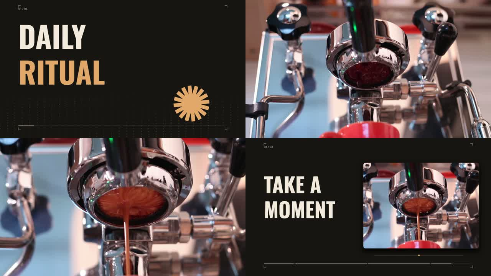

# Agent Motion Studio

**Make a short film locally. Replace one scene. Keep the takes you already like.**

An open-source local studio for short films made by people and their AI agents. Import clips, images and music, assemble a storyboard, compare takes and export a real MP4. The studio is free; cloud generation uses your provider account and its charges. Your official external agent can use the CLI and skill. Local video-model inference is a future capability.

The product goal is to make and revise a film from a brief through your own Claude Code, Codex or another supported agent, using your subscription or API access. Procedural motion, titles and editing supplied footage use the local renderer and do not require a video-generation key. A Codex desktop session and a real API-agent have demonstrated film creation; two demonstration edits, restore and reopen are verified. A fresh official Codex CLI session, resumed after developer repairs to its temporary budget transport, created a new meetup film, handled three subsequent corrections and reopened it from an installed runtime. On 7 October 2026 the project owner accepted the final fastgrep after two personally requested alignment corrections and a sound revision. An independent new user, Claude Code, a live run of the new API-agent actions and other operating systems remain separate unverified checks. [Exact verification scope](docs/AGENT_VALIDATION.md). Optional neural-video generation has a separate Replicate integration.

**0.1.0 · Experimental developer preview** · [Current status](docs/STATUS.md) · [Development plan](docs/PLAN_V0.2_RU.md) · [Contributing](CONTRIBUTING.md) · [Release notes](docs/releases/v0.1.0.md)



[Watch the 20-second original](docs/media/coffee-original.mp4) · [Watch the second-scene remix](docs/media/coffee-changed.mp4) · [Editable example](examples/coffee-ritual/project.json)

Footage by **Scott Schiller**, [Morning Espresso Routine](https://www.flickr.com/photos/schill/14588642105/). Excerpts, crop, titles and procedural music added with Agent Motion Studio. Film remix: **[CC BY-SA 2.0](https://creativecommons.org/licenses/by-sa/2.0/)**. [Full credits](examples/coffee-ritual/CREDITS.md). This is real filming of one setup; no AI video model was used for the example.

## Make a film with your agent

Follow [installation and agent setup](docs/GETTING_STARTED.md), install the bundled skill, then open your official agent in that workspace. Invoke `$agent-motion-studio` in Codex or `/agent-motion-studio` in Claude Code and give it a brief:

> Create a 15-second vertical film for the fictional Frontend Night meetup: 14 November, 19:00, Almaty, free entry. Use #101820 background and #FEE715 accent. Save a local MP4 and an editable project with sources and history. No external media calls.

After watching the original, send two separate corrections:

> Shorten the second scene by one second.

> Switch to a light theme with #FFF8E1 background, #101820 text and #8A4900 accent.

The agent uses the local renderer, previews ordinary scene corrections and exports separate versions. Ask it to reopen the saved project or restore a scene/full film through history. Keep the complete project folder with assets and credits when moving it. For an existing film, supply its `project.json` path and continue it; `new` is for a new brief. [Detailed agent workflow and API limits](docs/AGENT_WORKFLOW_RU.md).

## Try your first remix

Install **Node.js ≥22.12**, **Chrome/Chromium/Edge for rendering**, **FFmpeg with libx264/AAC**, and **ffprobe**. Keep FFmpeg/ffprobe on PATH. The app can also use `CHROME_PATH`, `FFMPEG_PATH` and `FFPROBE_PATH`. [macOS commands, HTTPS/SSH and loopback requirements](docs/GETTING_STARTED.md) · [verification scope](docs/COMPATIBILITY.md).

Clone or download this repository, open a terminal in its folder, then:

```sh
npm ci --ignore-scripts
npm run build
npm run doctor
node scripts/install-agent-skill.mjs --client codex --scope project
node dist/cli.js init coffee-ritual --dir projects/my-first-remix
node dist/cli.js studio projects/my-first-remix/project.json
```

Continue when doctor reports `ready:true` (exit 0); exit 3 lists dependency errors and fixes. [Installation and troubleshooting](docs/GETTING_STARTED.md). Skill installation is optional for manual editing; use `--client claude` for Claude Code. Start the official agent in this workspace; Codex uses `$agent-motion-studio`, Claude Code `/agent-motion-studio`.

Doctor and the renderer check Canvas/PNG readback. Brave is unsupported as the renderer because its privacy protection can change pixels between sessions; select Chrome/Chromium/Edge with `CHROME_PATH`. Your usual browser can still display the studio. Normal CLI/API exports also appear in its project export list, with earlier versions and unsaved drafts preserved.

Open the **complete session URL** printed by the CLI. Keep it private. The editor supports RU/EN and remembers your choice; select RU for the labels below:

1. Select scene 2, `first-pour`.
2. Change **Выбранный исходник / дубль** (source/take) to `first-drops.mp4`; use trim start `1` second and duration `7` seconds.
3. Click **Предпросмотр сцены** (preview scene). Watch the trimmed/cropped result before saving.
4. Click **Сохранить сцену** (save scene), then **Экспорт MP4**. The full film appears in the main player.
5. Click **Вернуть предыдущий вариант** (restore previous take) and export again. The original sources remain available.

Your copy lives under `projects/`, which Git ignores. To reopen it, repeat only the `studio` command. Stop the server with Ctrl+C. If the port is busy, add `--port 4174`. [Detailed guide](docs/GETTING_STARTED.md) · [Инструкция на русском](docs/STUDIO_RU.md).

Already have a film? Open its existing `project.json` with `studio`; give that path to your agent. Do not run `new` or `init` again. Keep its assets and history together. [Agent continuation](docs/AGENT_WORKFLOW_RU.md#продолжение-существующего-фильма) · [Independent user trial](docs/USER_TRIAL_RU.md).

## Use the built runtime

For a manually supplied first-user kit, open its `START_HERE_RU.md`: it includes the runtime, a permitted coffee MP4, credits and a blank human protocol. [Preparation and participant route](docs/USER_TRIAL_RU.md). The kit records its source SHA and technical self-run separately from an independent person's result.

The release preparation produces `agent-motion-studio-0.1.0.tgz`. With that file downloaded, install it in an empty folder:

```sh
npm init -y
npm install --ignore-scripts --omit=dev /path/to/agent-motion-studio-0.1.0.tgz
npx --no-install agent-motion-studio doctor --json
node node_modules/agent-motion-studio/scripts/install-agent-skill.mjs --client codex --scope project
npx --no-install agent-motion-studio init coffee-ritual --dir film
npx --no-install agent-motion-studio studio film/project.json
```

Replace the archive path with its location on your computer; quote paths containing spaces. This needs the same system tools but no TypeScript build or source checkout. npm downloads dependencies unless they are cached. There is no npm-registry installation promised for 0.1; `private: true` intentionally prevents accidental registry publication.

## What works in 0.1

- Import video, images and music as copied, content-addressed sources.
- Arrange scenes with titles, images, trim, cover/contain and focal points.
- Preview an unsaved scene using the export renderer at 1080p/30 fps.
- Compare local and external-agent edits and explicitly resolve conflicts.
- Restore previous takes, reopen projects and export H.264/AAC MP4.
- Edit through the CLI with the same validation and history as the browser.
- Create in either aspect, apply a brand palette and accept an initial storyboard atomically.
- Keep authored title casing and supporting text; select a saved RU/EN editor language.

Agents can use `state`, `import`, `edit --action action.json --if-match ETAG`, `validate` and `render`. [Agent skill](skills/agent-motion-studio/SKILL.md) · [Project format](docs/MANIFEST.md). Local editing and export need no model key.

For a new film, use `new --dir projects/my-film`. Agents can preview an ordinary correction with `preview PROJECT --action ACTION.json --if-match ETAG --out NEW_DIRECTORY --json`, then accept the same action through `edit`. Install the bundled skill with `node scripts/install-agent-skill.mjs --client codex --scope project` (or `--client claude`). The installer leaves client login and existing edited skills intact. [Client setup, first brief and API-agent path](docs/AGENT_WORKFLOW_RU.md).

## Development checkout: one generated replacement take

The P1 implementation connects **Replicate `wan-video/wan-2.2-i2v-fast`** in image-to-video mode to an existing video scene. It persists a job, resumes its known remote ID, downloads a candidate separately, previews it, accepts it explicitly and keeps the previous take for restoration. The production path requires `REPLICATE_API_TOKEN` in the server environment; it does not substitute a mock when the key is missing.

Run the first remix above, select a video scene and use **Новый AI-дубль**. Import a permitted PNG/JPEG reference ≤256 KiB first. Preparation stays local. Review the exact prompt, reference, settings and dated cost estimate before authorizing one submit. The model clip is 121 frames at 16 fps (7.5625 seconds); the selected scene keeps its duration, so scenes longer than this are rejected. Candidate trim starts at zero and crop controls stay separate from ordinary scene edits.

Reopening the project only reads local jobs. Use **Возобновить наблюдение** to check a submitted job and **Скачать результат этого задания** to retry its output; neither creates another generation. Preview the candidate, watch it and explicitly accept. Then export, restore the previous scene and export again through the existing editor. See the [generation and CLI guide](docs/GENERATION_RU.md) and [provider decision](docs/GENERATION_PROVIDER_DECISION.md).

If a submission response is lost, check the same provider account and explicitly acknowledge the possible existing charge in **Зафиксировать проверку аккаунта**. The old request stays unknown and is never repeated; a new prepared intent needs separate spending/reference approval. Stop and restart do not release this uncertainty. Each project directory supports one generation manifest; see the guide before binding an older local job store.

Default tests use a controlled provider and require no paid calls. This checkout's offline implementation is distinct from **real provider verified** and **full workflow verified**, which require an authorized live run and its evidence. A key by itself grants no spending or reference-upload permission. The local agent-film demonstration is complete within its stated client limits; P2 focuses on a new user following this README independently.

## Current limits

The current checkout also supports [editable object compositions](docs/COMPOSITION.md): independently positioned/animated text, rect/ellipse graphics and local images. Agents author objects through normal scene actions; the browser opens, previews, shortens, restores and exports them. This is a data-driven extension, with fixed fonts/aspects and no realtime object editor.

- Preview is silent and generated on demand. Viewing the entire film requires export.
- Source-video audio is muted; use a file music track. Narration/captions require full export.
- 1080p/30 fps, 16:9 or 9:16, SDR BT.709, hard cuts in v2. No HDR, realtime timeline or multitrack editor.
- 12 scenes, 24 assets, 1–60 seconds; the intended workflow is 3–4 scenes / 15–30 seconds.
- Imports read files into RAM: video ≤512 MiB, images ≤20 MiB, audio ≤100 MiB. Keep renders sequential.
- History retains 100 snapshots. Sources/exports are not automatically pruned. Draft recovery belongs to the current browser tab; it is not a backup.
- The server is local and intended for one user. No built-in chat or studio billing. The first provider integration uses your own Replicate API account; local inference is not implemented.

The code is free under MIT. External generation services have their own costs and terms; selected prompts/references leave your computer only after an authorized submit. Tests establish technical behavior; they do not establish artistic quality or demand.

## Build with us

One issue, one branch, one reviewable outcome. See [CONTRIBUTING](CONTRIBUTING.md) for setup, working as a pair, the code map and pull requests.

```sh
npm run check
npm run test:integration
npm run release:prepare
```

`check` needs a Git checkout. Integration tests use real Chrome and FFmpeg and make no video-generation requests. `release:prepare` builds local source/runtime archives and checks their contents; it does not upload anything. Maintainers should follow the [release guide](docs/RELEASING.md), including installation verification.

Code and separate original procedural music: [MIT](LICENSE). Fonts: SIL OFL. Coffee footage derivatives, still and finished remix: CC BY-SA 2.0. Keep the [media credits](examples/coffee-ritual/CREDITS.md) when sharing an adaptation. [Third-party notices](THIRD_PARTY_NOTICES.md) · [Security](SECURITY.md).
